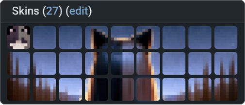

# NameMC Profile Art Generator

Create a personalized banner for your NameMC profile using this script, which transforms a single input image into an array of custom Minecraft skins. These skins, when uploaded to your Minecraft profile in sequence, will display a cohesive design on your NameMC profile, akin to a mosaic.

## How to use (CLI)
- download the release for your os from the releases page of the repo (win/linux)
- run the executable
- enter the path to your file (make sure its a png)
- it will create an output dir for you and put the files in it
- apply the skins in order with your main skin last
- star the repo :3

## How to use (GUI)
- uhh im working on it

## How to use (WEB)
- its happening man i swear